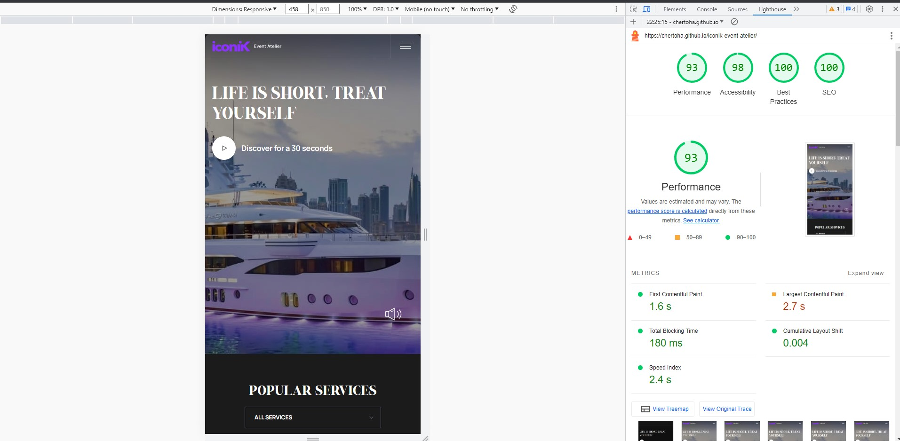
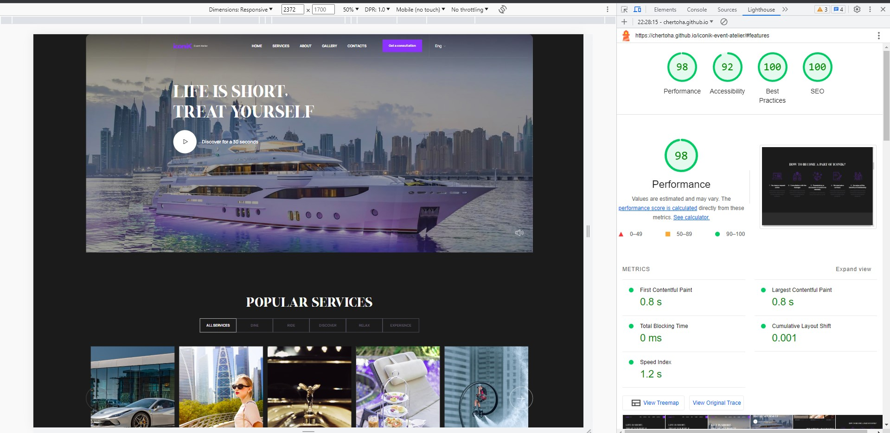

# Iconik Event Atelier  

It is a pet layout project for event studio   

## Tech Stack

**Client:** Parcel, HTML/PUG, CSS/SASS, JavaScript, BEM 

**Libs:** Swiper js, Mapbox 

## Authors

- [Anton Chertok](https://github.com/chertoha)

## Features

- adaptive layout
- otimized images
- swiper for info cards 
- drop down buttons
- customized location map

## Feedback

If you have any feedback, please reach out to us at a.chertok@akatech.com.ua

## Environment Variables

To run this project, you will need to add the following environment variables to your .env file

`MAPBOX_ACCESS_TOKEN`

## Optimization screenshots

### Mobile 

### Desktop 

